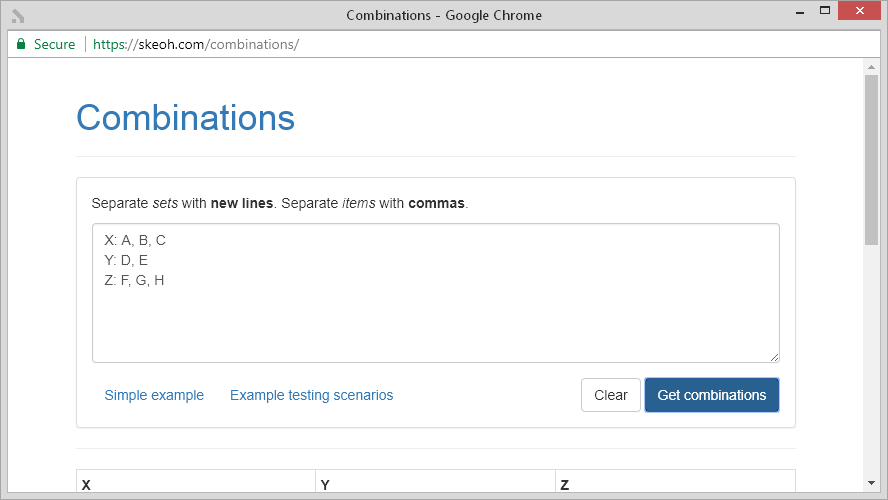

[Combinations][site-url]
========================

[][site-url]

## What?

Takes an input like this...

```
X: A, B, C
Y: D, E
Z: F, G, H
```

...and produces an output like this

| X | Y | Z |
|---|---|---|
| A | D | F |
| A | D | G |
| A | D | H |
| A | E | F |
| A | E | G |
| A | E | H |
| B | D | F |
| B | D | G |
| B | D | H |
| B | E | F |
| B | E | G |
| B | E | H |
| C | D | F |
| C | D | G |
| C | D | H |
| C | E | F |
| C | E | G |
| C | E | H |

## Why?

Useful for creating a list of test scenarios. Split variables by lines and values by commas to produce a list of every combination of those given values.

## License

MIT

[site-url]: https://skeoh.com/combinations/
